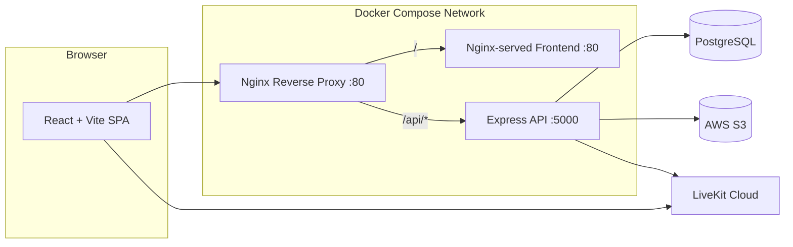

<div align="center">

# 🎬 StreamVault

**A production-ready video streaming & live learning platform**

Stream, track, and teach — with video courses, downloadable resources, a community hub, and real-time LiveKit meetings — all in one self-hosted monorepo.

[]()
[]()
[]()
[]()
[]()
[]()
[]()
[]()
[]()
[]()
[]()
[]()
[]()

</div>

---

## ✨ Overview

**StreamVault** is a full-stack, self-hostable learning platform that brings premium video education and live interaction together. It combines an on-demand course library with a real-time virtual classroom, so you can **watch**, **learn**, **teach**, and **meet live** — all from one place.

It is built as a **monorepo** with a React + Vite frontend, an Express + Prisma backend, and a Docker Compose stack fronted by an Nginx reverse proxy. Every component is designed for production: signed URLs, rate limiting, JWT auth with refresh rotation, structured logging, container health checks, and automated CI/CD.

## 🚀 Key Features

### 🎥 Video Courses
- **Structured courses** with ordered sections and videos
- **Custom-built video player** with playback speed, seek preview, buffered-bar, Picture-in-Picture, fullscreen, and full keyboard shortcuts
- **Autoplay-next** with countdown + persistent player preferences (volume, speed, autoplay)
- **Resume playback** — progress is saved every few seconds and on pause
- **"Continue watching"** row on your dashboard
- **Downloadable resources** (PDFs, notes) per video, when enabled
- **Secure streaming** via time-limited, presigned S3 URLs

### 💬 Community & Engagement
- **Community feed** with threaded replies and author profiles
- **Per-video comments**
- Admin can moderate the community and toggle the feature on/off globally

### 🖥️ Live Meetings (LiveKit)
- Schedule, start, and end **live meetings** with a unique 6-character join code
- **Real-time video/audio** rooms via LiveKit WebRTC
- **Live chat** with message history
- **Participants panel** with roles (HOST / COHOST / STUDENT / GUEST)
- **Attendance tracking** — duration, camera-on and mic-on time per participant
- **Host controls** — kick participants, start/stop room-composite recording to S3
- **Guest join** by code — no account required for viewing

### 🔐 Authentication & Users
- Register / login with email + password (bcrypt hashed)
- **Google OAuth** sign-in with account linking
- JWT **access + refresh tokens** with automatic silent refresh (queued retries)
- Role-based access: **ADMIN** and **STUDENT**
- Profile management with avatar upload

### 🛠️ Admin Panel
- Analytics dashboard (courses, videos, users, views)
- Manage users & roles, courses, videos, and meetings
- Upload pipeline for videos, thumbnails, avatars & resources
- Moderate community posts and comments

### 🛡️ Production-Ready Engineering
- Zod-validated request payloads, strict typed env config
- Helmet, CORS allow-listing, per-route **rate limiting**
- Pino structured logging with request/response serializers
- Graceful shutdown, S3 presigned uploads & streams
- Nginx reverse proxy, Docker health checks, CI/CD via GitHub Actions

## 🧱 Tech Stack

| Layer       | Technology |
|-------------|------------|
| Frontend    | React 19, TypeScript, Vite, Tailwind CSS 4, React Router 7 |
| State       | Zustand, TanStack Query |
| Forms       | React Hook Form + Zod |
| UI          | shadcn-style components, Lucide icons, CVA + tailwind-merge |
| Realtime    | LiveKit (client + server SDK), `@livekit/components-react` |
| Backend     | Node.js, Express 5, TypeScript |
| Database    | PostgreSQL, Prisma ORM |
| Storage     | AWS S3 (presigned upload/stream/delete) |
| Auth        | JWT (access + refresh), bcrypt, Google OAuth |
| Logging     | Pino + pino-http |
| Infra       | Docker Compose, Nginx, GitHub Actions (EC2 deploy) |

## 🏗️ Architecture



- **Frontend** is built into static assets and served by `serve` inside its container.
- **Backend** exposes a JSON REST API under `/api`, protected by auth + rate limiting.
- **Nginx** terminates external traffic and proxies `/` → frontend, `/api/` → backend.
- **LiveKit** handles WebRTC signaling directly between the browser and LiveKit Cloud; the backend issues scoped access tokens and manages rooms, chat, attendance, and egress recordings.

## 📂 Project Structure

```
streamvault/
├── frontend/                  # React 19 + Vite + Tailwind SPA
│   ├── public/                # Static assets (favicon, logo)
│   └── src/
│       ├── components/        # UI primitives, layout, meeting room, video player
│       ├── hooks/             # useAuth, useCourses, useMeetings, useProgress, ...
│       ├── layouts/           # Main, Auth, and Admin layouts
│       ├── pages/             # Public, authenticated, and admin pages
│       ├── routes/            # Lazy-loaded route definitions
│       ├── services/          # Typed API clients (axios)
│       ├── store/             # Zustand stores (auth, theme, player, upload)
│       ├── types/             # Shared TypeScript types
│       ├── validations/       # Frontend Zod schemas
│       └── lib/               # axios setup, utils, video helpers
│
├── backend/                   # Express 5 + Prisma API
│   ├── prisma/
│   │   ├── migrations/        # SQL migrations
│   │   ├── schema.prisma      # Data model (users, courses, meetings, ...)
│   │   └── seed.ts            # Creates the initial admin user
│   └── src/
│       ├── config/            # env, database, logger, s3, livekit
│       ├── controllers/       # Request handlers
│       ├── services/          # Business logic
│       ├── repositories/      # Data access layer (Prisma)
│       ├── middleware/        # auth, error, rateLimiter, validate
│       ├── routes/            # Route definitions
│       ├── validations/       # Zod schemas (backend)
│       └── utils/             # ApiError, tokens, slug, params, asyncHandler
│
├── nginx/
│   └── default.conf           # Reverse-proxy configuration
├── docker-compose.yml         # backend + frontend + nginx stack
├── package.json               # Root dev/build/typecheck scripts
└── .github/workflows/         # CI/CD pipeline
```

## 📦 Prerequisites

- **Node.js 20+** (the Docker images use Node 22)
- **npm**
- **PostgreSQL** (local, or Neon / any remote instance)
- **AWS S3 bucket** + access keys (for uploads/streaming) — *optional for local dev*
- **LiveKit Cloud** project (URL, API key, secret) — *required for live meetings*
- **Docker + Docker Compose** — for the production stack

## 🚦 Getting Started (Local Development)

### 1. Install dependencies

```bash
npm run install:all        # installs root + frontend + backend deps
```

### 2. Configure environment variables

Create `backend/.env` from the template:

```bash
cp backend/.env.example backend/.env
```

Then fill in at least `DATABASE_URL`, `JWT_SECRET`, `JWT_REFRESH_SECRET`, and `CLIENT_URL`.

### 3. Prepare the database

```bash
cd backend
npx prisma generate
npx prisma migrate dev
npm run prisma:seed        # creates the default admin account
cd ..
```

### 4. Start the dev servers

```bash
npm run dev                # runs backend (:5000) and frontend (:5173) together
```

- Frontend: http://localhost:5173 (proxies `/api` → `:5000`)
- Backend health check: http://localhost:5000/health

> Tip: run each side separately with `npm run dev:frontend` / `npm run dev:backend`.

## ⚙️ Environment Variables

### Root — `/.env` (used by docker-compose)

| Variable          | Description                          |
|-------------------|--------------------------------------|
| `VITE_API_URL`    | API base URL baked into the frontend build (default `/api`) |
| `VITE_LIVEKIT_URL`| Public LiveKit WebSocket URL (e.g. `wss://project.livekit.cloud`) |

### Backend — `/backend/.env`

| Variable                  | Description                                        |
|---------------------------|----------------------------------------------------|
| `NODE_ENV`                | `development` \| `production`                      |
| `PORT`                    | API port (default `5000`)                          |
| `LOG_LEVEL`               | `trace` \| `debug` \| `info` \| `warn` \| `error`  |
| `DATABASE_URL`            | PostgreSQL connection string                       |
| `JWT_SECRET`              | Secret for access tokens                           |
| `JWT_REFRESH_SECRET`      | Secret for refresh tokens                          |
| `JWT_EXPIRES_IN`          | Access token lifetime (default `15m`)              |
| `JWT_REFRESH_EXPIRES_IN`  | Refresh token lifetime (default `7d`)              |
| `AWS_REGION`              | S3 region (default `us-east-1`)                    |
| `AWS_ACCESS_KEY_ID`       | S3 access key (optional)                           |
| `AWS_SECRET_ACCESS_KEY`   | S3 secret key (optional)                           |
| `AWS_BUCKET_NAME`         | S3 bucket for videos/thumbnails/avatars            |
| `LIVEKIT_URL`             | LiveKit server URL (required for meetings)         |
| `LIVEKIT_API_KEY`         | LiveKit API key                                    |
| `LIVEKIT_API_SECRET`      | LiveKit API secret                                 |
| `LIVEKIT_EGRESS_S3_BUCKET`| S3 bucket for meeting recordings (optional)        |
| `CLIENT_URL`              | Frontend origin(s), comma-separated for CORS       |
| `SERVER_URL`              | Public backend URL (used for OAuth redirects)      |
| `GOOGLE_CLIENT_ID`        | Google OAuth client ID (optional)                  |
| `GOOGLE_CLIENT_SECRET`    | Google OAuth client secret (optional)              |
| `ADMIN_EMAIL` / `ADMIN_PASSWORD` / `ADMIN_NAME` | Seed admin account (defaults: `admin@streamvault.app` / `admin12345`) |

## 🐳 Running with Docker (Production)

The stack ships three containers wired into a shared bridge network:

| Service   | Image/build          | Port    | Notes                              |
|-----------|----------------------|---------|------------------------------------|
| `backend` | `./backend` (Node 22) | expose 5000 | Health-checked (`/health`) |
| `frontend`| `./frontend` (Vite build + serve) | expose 80 | Waits for healthy backend |
| `nginx`   | `nginx:alpine`       | `80:80` | Reverse proxy for both |

```bash
# 1. Create both env files
cp backend/.env.example backend/.env
cp .env.example .env

# 2. Fill in real values (DB, JWT, S3, LiveKit, VITE_*), then:
docker compose up -d --build
```

The app is then available at **http://localhost:80** and the API at `/api`.

Useful commands:

```bash
docker compose ps           # status of the stack
docker compose logs -f      # follow container logs
docker compose down         # stop the stack
```

> **Note:** `docker-compose.yml` loads `backend/.env` for the backend and passes `VITE_API_URL` / `VITE_LIVEKIT_URL` from the root `.env` as build args for the frontend.

## 🧑💼 Default Admin

After running `npm run prisma:seed` (or via `ADMIN_EMAIL`/`ADMIN_PASSWORD` env vars), a default admin is created:

| Field | Default value |
|-------|---------------|
| Email | `admin@streamvault.app` |
| Password | `admin12345` |

**Change these before any production deployment.**

## 🔌 API Overview

All endpoints are prefixed with `/api`. Responses follow `{ success, message, data }`.

| Area       | Base path        | Highlights |
|------------|------------------|------------|
| Health     | `/health`        | Liveness probe (not logged) |
| Auth       | `/auth`          | `register`, `login`, `logout`, `refresh`, `me`, `change-password`, Google OAuth |
| Courses    | `/courses`       | List, get, create, update, delete |
| Videos     | `/videos`        | List, get (with signed stream URL), create, update, delete, resources |
| Uploads    | `/uploads`       | Presigned URL generation for files |
| Progress   | `/progress`      | Upsert & list watch progress ("continue watching") |
| Community  | `/community`     | Threads, replies, global on/off settings |
| Comments   | `/videos/:videoId/comments` | Per-video comments |
| Meetings   | `/meetings`      | CRUD, join by code, tokens, chat, start/end, kick, recording, attendance |
| Admin      | `/admin`         | Analytics, user management, community moderation |

## 📜 Root Scripts

| Command              | Description                                      |
|----------------------|--------------------------------------------------|
| `npm run dev`        | Run backend + frontend concurrently (dev mode)   |
| `npm run dev:frontend` | Run only the frontend                          |
| `npm run dev:backend`  | Run only the backend                           |
| `npm run build`      | Type-check and build both packages               |
| `npm run typecheck`  | Run TypeScript checks in both packages           |
| `npm run install:all` | Install dependencies for root, frontend & backend |

Backend-specific Prisma scripts (`cd backend`): `prisma:generate`, `prisma:migrate`, `prisma:push`, `prisma:studio`, `prisma:seed`.

## ☁️ Deployment (GitHub Actions)

The included workflow (`.github/workflows/deploy.yml`) deploys to an **EC2** instance on every push to `main`:

1. `actions/checkout@v4`
2. `appleboy/ssh-action` connects to the server
3. `git pull origin main`
4. `docker compose up -d --build`

Configure these repository **secrets**:

| Secret            | Description                    |
|-------------------|--------------------------------|
| `EC2_HOST`        | EC2 public IP / DNS            |
| `EC2_USERNAME`    | SSH username (e.g. `ubuntu`)   |
| `EC2_SSH_KEY`     | Private SSH key (PEM)          |

Ensure the server has the repo cloned at `~/StreamVault` with `.env` files already present.

## 🧪 Notes

- No automated test suite is configured yet — run `npm run typecheck` and `npm run lint` (frontend uses oxlint) to validate changes.
- Video files are streamed directly from S3 through signed URLs; the player is a native `<video>` element, so HLS/DASH playback depends on the source format you upload.

## 📄 License

Distributed under the ISC License. See `backend/package.json` and the repo for details.

---

<div align="center">

**Made with Om — happy streaming!**

</div>
